# learn-docker
# I: Dockek là gì?
- docker là ứng dụng mã nguồn mở.nó giúp cho chúng ta tạo ra các container để chúng ta phát triển triển khai ứng dụng. Hay có thể hiểu là nó cho ứng dụng chạy trong môi trường cách ly gọi là container.Chúng ta có thể xem container như là một máy ảo.
- Đây là mô hình mô tả hoạt động của docker:

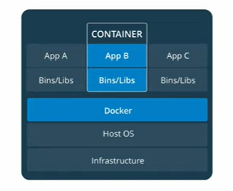

=> Chúng ta có một máy vật lý trong(hay còn gọi là máy host) chúng ta dùng để cài docker. Khi docker chạy chúng ta muốn chạy một ứng dụng nào đó chạy trên môi trường của docker thì docker sẽ tạo ra một môi trường cách ly gọi là container. Trong các container nó chứa đầy đủ các thư viện, các gói ứng dụng nhằm đảm bảo cho ứng dụng của chúng ta hoạt động được trong docker. Docker có thể tạo ra nhiều container để chạy nhiều ứng dụng khác nhau. Giữa các container sẽ cách ly với nhau nên nó không có tương tác trực tiếp qua lại với nhau. Nó tương tự như việc chúng ta cài các máy ảo khác nhau dể chạy các ứng dụng khác nhau.
- VMs với Docker

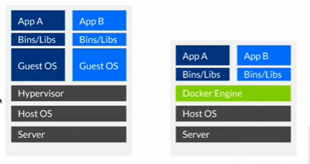

# II: Lệnh sử dụng docker
-  Image trong docker là những phần mềm được đóng gói và quản lý bởi docker.
-  Ví Dụ:
  + Images đóng gói hệ điều hành PHP
  + Images đóng gói Hệ điều hành Ubuntu

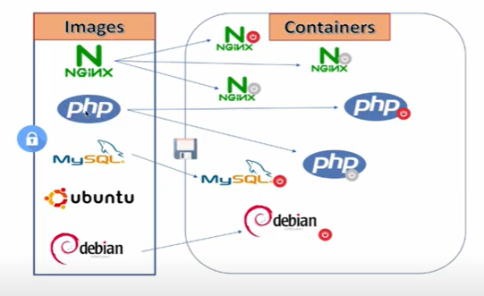

Trong các Images nó chỉ đọc không thể sửa đổi. Khi Images được docker khởi chạy thì phiên bản của Images được gọi là các container. Các container có thể ghi được dữ liệu vào trong đó
  - Để kiểm tra xem docker có những images nào chúng ta sử dụng lệnh: docker images(Mở Windows powerShell)

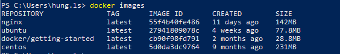

Chú thích: REPOSITORY là tên của image, TAG là phiên bản của image, IMAGE ID: mã của Image, CREATE: ngày tạo,SIZE: kích thước image

Có thể Xem các Image của docker tại đây: https://hub.docker.com/search?q=image&type=image
- Có thể tìm kiếm image trên Windows powerShell theo cú pháp: docker search keyword
tài azure data studio về.
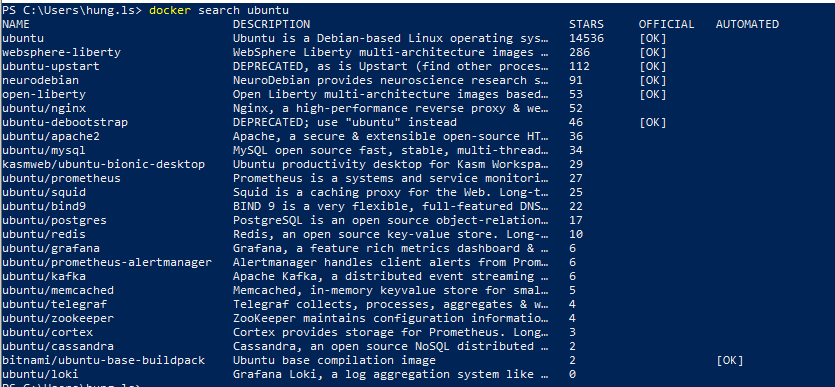

  - Muốn cài đặt một image ta sử dụng câu lệnh: docker pull image:tag

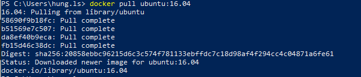

  - Muốn cài đặt một image với phiên bản mới nhất ta sử dụng câu lệnh: docker pull image:latest hoặc docker pull image
  - Muốn xóa một image ta sử dụng câu lệnh: docker image rm image:Tag hoặc docker image rm IMAGE ID
    + IMAGE ID trong phần chạy docker images


  - Muốn chạy một Image chúng ta sử dụng lệnh sau: docker run -it ubuntu:latest hoặc docker run -it IMAGE ID
    + IMAGE ID trong phần chạy docker images

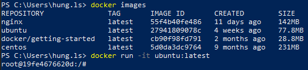
 
Chúng ta chạy ubuntu với tài khoản root hostname là 19fe4676620d.
- Chúng ta có thể kiêm tra thông tin của ubuntu này như sau:

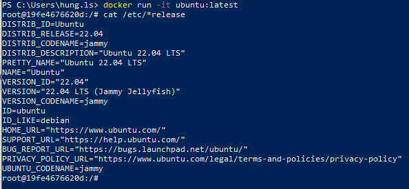

  - Kiêm tra các các container đang chạy sử dụng docker ps và tất cả container đang có là docker ps -a

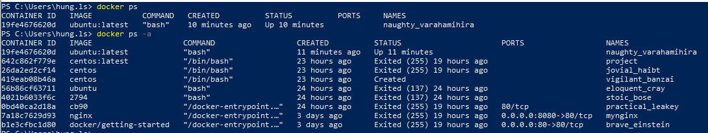

  - Chạy container sử dụng:  docker start CONTAINER ID hoặc  docker start NAMES

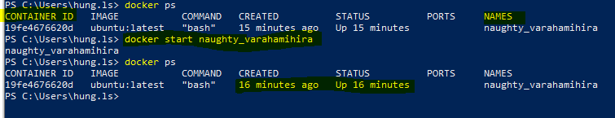

  - tắt container sử dụng:  docker stop CONTAINER ID hoặc  docker stop NAMES

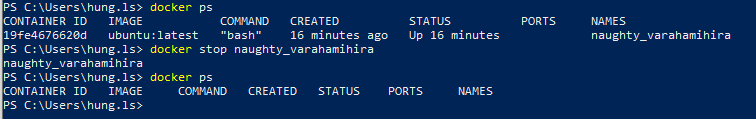

  - Chạy container có host do chúng ta tạo ra: 

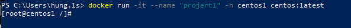
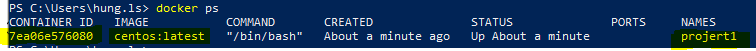


```Dockerfile
Tóm tắt các lệnh làm quen

#kiểm tra phiên bản
docker --version

#liệt kê các image
docker images -a

#xóa một image (phải không container nào đang dùng)
docker images rm imageid

#tải về một image (imagename) từ hub.docker.com
docker pull imagename

#liệt kê các container
docker container ls -a

#xóa container
docker container rm containerid

#tạo mới một container
docker run -it imageid 

#thoát termial vẫn giữ container đang chạy
CTRL +P, CTRL + Q

#Vào termial container đang chạy
docker container attach containerid

#Chạy container đang dừng
docker container start -i containerid

#Chạy một lệnh trên container đang chạy
docker exec -it containerid command
```
# III/Lệnh Docker exec, lưu container thành image với commit, xuất image ra file
## 1:

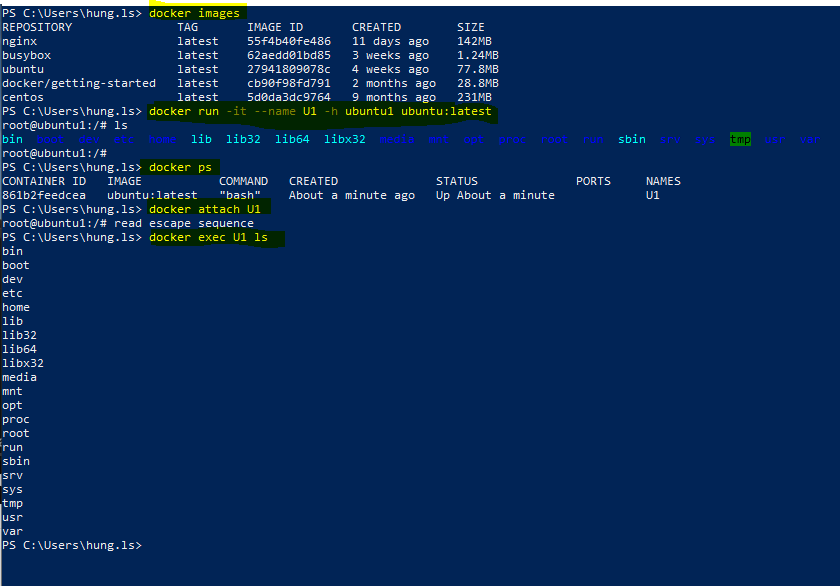

- Cài đặt ping: root@ubuntu1:/# apt install iputils-ping
-  Chạy lệnh ping: root@ubuntu1:/# ping google.com
- Cài đặt Vim : root@ubuntu1:/# apt install vim
##1.1 Commit container thành Image:


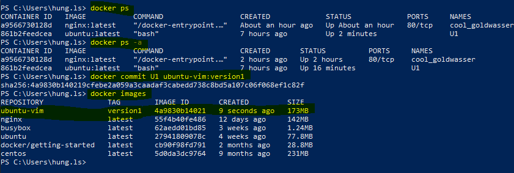

- tiến hành commit: Vào thư mục màn hình desktop bằng lệnh cd


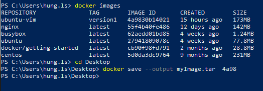

-  Bây giờ ngoài màn hình desktop sẽ có thư mục myImage.tar chúng ta vừa commit.
-  Chúng ta có thể sử dụng file Image này để chia sẽ cho nhiều máy tính.
-  Để sử dụng file image này chúng ta dùng lệnh: docker load -i myImage.tar
-  Chúng ta có thể đặt tên Repository và tag cho Image bằng lệnh sau: 
    docker tag IMAGE ID Tên_Repository:Tag 
# 2: Cách chia sẻ dữ liệu từ máy host cho container và giữa các container với nhau.
## 2.2: Cách chia sẻ dữ liệu từ máy host cho container
- Bây giờ chúng ta tạo một folder Dulieu  chứa tập tin test.txt trong tập tin này chứa nội dung là xin chào.
- Để container truy cập được dữ liệu này cũng như ghi được dữ liệu vào file này và sau đó chúng ta xóa container đi và thư mục này vẫn còn tồn tại trên máy host: 
   + Chúng ta tạo một container chứa trong images ubuntu-vim 
   docker run -it -v pathHost:pathContainer Imageid
   
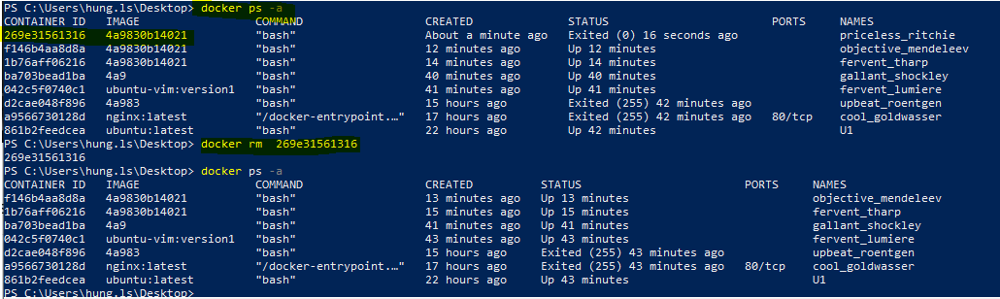

- có thể sử dụng lện vi tenFile: để xem nội dung trong file 
## 2.2:  Cách chia sẻ dữ liệu giữa các container với nhau
-   Chúng ta tạo một container mới có tên là C1 : 
    +   docker run -it -v C:\Users\hung.ls\Desktop\DuLieu:/home/dulieu --name C1 4a9830b14021
-   Truy cập /home/dulieu# ls để xem các file có trong C1
-   Tạo thêm một container C2 có thể đọc và ghi file từ C1 :
    +   docker run -it --name C2 --columes-from C1 ubuntu:latest


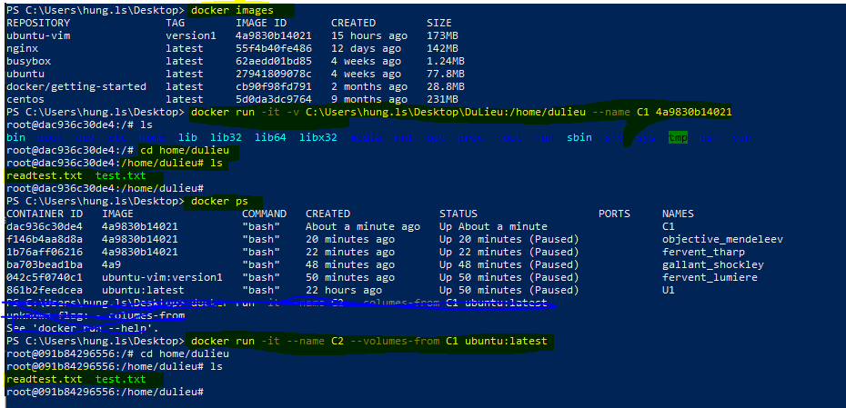

-   Mở một Terminal mới chạy vô nhánh C1 


-   Tạo một file mới tên testC2.txt trên nhánh C2

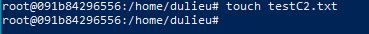

-   Chạy lệnh ls trên nhánh C1 : /home/dulieu# ls và xem kết quả.

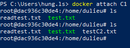

## 3:  tạo và quản lý ổ đĩa docker volume
-   Xem danh sách các ổ đĩa: docker volume ls
-   Tạo mới một ổ đĩa: docker volume create Tên_ổ_Đĩa
-   Xem thông tin ổ đĩa: docker volume inspect Tên_ổ_Đĩa
 
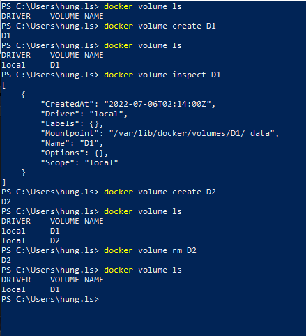

-   Bây giờ chúng ta muốn gán ổ đĩa cho một container đễ container build dữ liệu cố định trong đó:
    + docker run -it --mount source=DiSk,target= Path_Container_ImageID
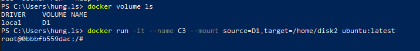

-   Bây giờ chúng ta có thể lưu dữ liệu mà không sợ mất đi khi chúng ta xóa container.
# IV:  Cài đặt, tạo và chạy PHP, phiên bản có PHP-FPM bằng Docker

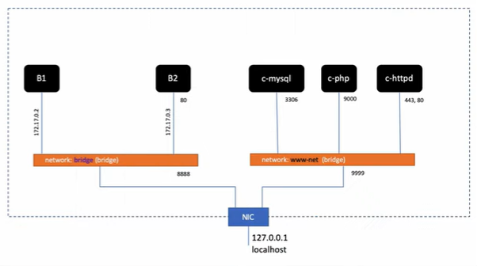

-  Kéo Image Php về và cài đặt network:

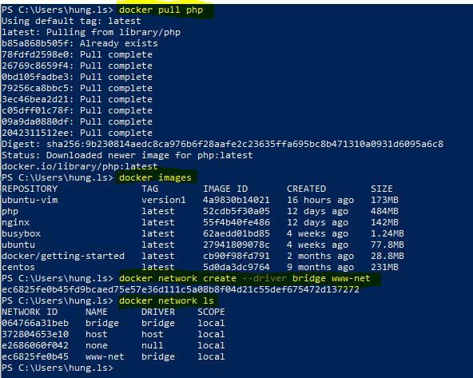

- Tạo một thư mục chưa code tên là myCode trong thư mục này tạo thư mục www và trong này tạo một file index.html
- Kiểm tra các image đã cài đặt: docker images
- Cài đặt Image php:  docker pull php:7.3-fpm
- Tạo các network : docker network create --driver bridge www-net
- Xem danh sách Network: docker network ls
- Chạy docker run -d --name c-php -h php -v /mycode/:/home/mycode/ --network www-net php:7.3-fpm
- Chạy docker ps để kiểm tra

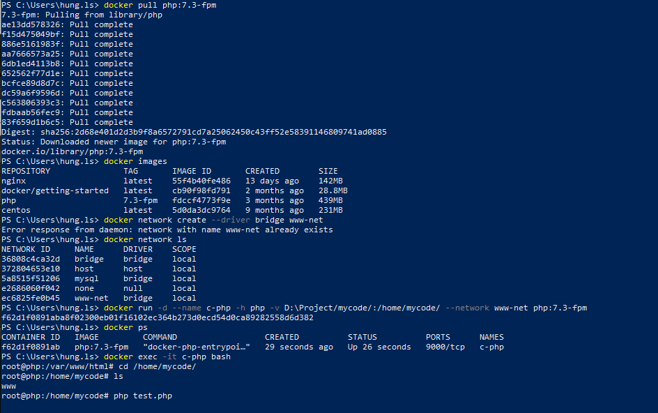

- Vào c-php: docker exec -it c-php bash
- Vào thư mục cd /home/mycode/
- Vào thư mục myCode vào www Tạo file test.php với nội dung sau: 
```Dockerfile
<?php
    phpinfo();
```
- Vào lại chạy  php test.php

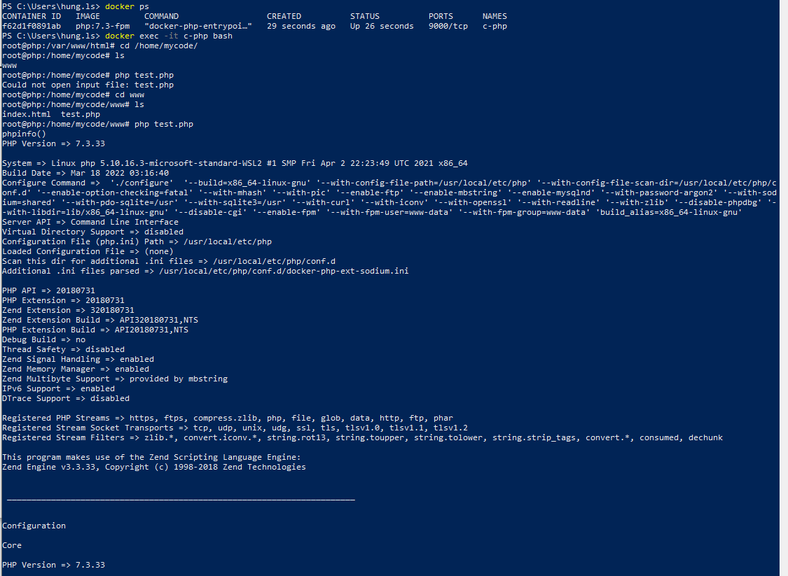

- Kiểm tra phiên bản php: php -version
# 2: Cài đặt, chạy Apache HTTPD bằng Docker
-   Khi máy chủ apache httpd chạy thì nó sẽ nạp file cấu hình ở đường dẫn user/local/apache2/conf/httpd.conf
-   Cài đặt httpd: docker pull httpd
-   lấy file hrrpd.conf lấy file này ra máy host.
    +   Chạy xong xóa luôn: --rm
    +   Coppy  httpd.conf từ /usr/local/apache2/conf/httpd.conf vào thư mục /home/mycode/:
        cp /usr/local/apache2/conf/httpd.conf /home/mycode/
-   Xem danh sách container : docker ps
-   Cài đặt httpd của apache : docker pull httpd
-   Xem các Image hiện có : docker images
-   Chạy  docker run --rm -v D:\Project/mycode/:/home/mycode/ httpd cp /usr/local/apache2/conf/httpd.conf /home/mycode/
-   Chạy code D:\Project/mycode/httpd.conf để mở file trên vysual code


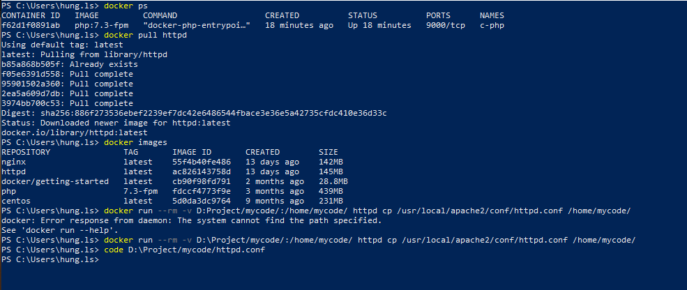

-   Kiểm tra bên trong thư mục D:\Project/mycode/ có thêm file httpd.conf

-   Tất cả các máy chủ http mà chúng ta tạo ra  nó sẽ chạy file PHP thông qua Proxy tức là khi chúng ta truy vấn tới các file có phần mở rộng là php thi apache sẽ yêu cầu server chạy SPM thi hành file PHP đó.
-   Để sử dụng được Proxy cho Apache chúng ta phải nạp các module Proxy như 
    +   mod_proxy_connect.so và mod_proxy.so

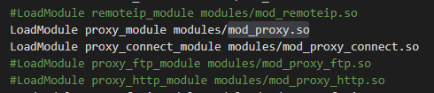

    +   mod_proxy_fcgi.so
    
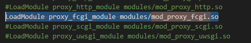

    +   Thiết lập PHP handler yêu cầu apache gọi chạy php thông qua Proxy: AddHandler "proxy:fcgi://c-php:9000" .php
    
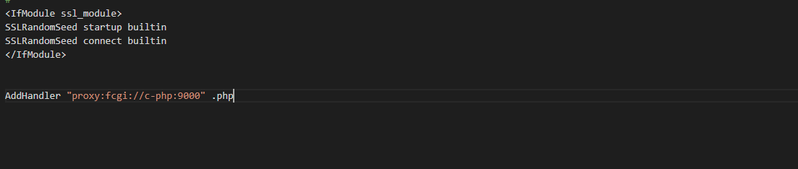

-   Thiết lập thư mục làm việc mặc định của php

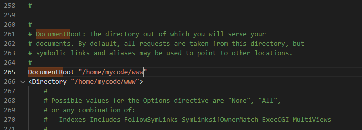

-   Vào file test.php ở máy host
```Dockerfile
<?php
    echo "Apache httpd";
    phpinfo();
```
-   Vào file index.html ở máy host
```Dockerfile
<?php
   <!DOCTYPE html>
<html lang="en">
<head>
    <meta charset="UTF-8">
    <meta http-equiv="X-UA-Compatible" content="IE=edge">
    <meta name="viewport" content="width=device-width, initial-scale=1.0">
    <title>Document</title>
</head>
<body>
    <h1>this is website runing on container</h1>
</body>
</html>
```
-   File httpd.conf đã sữa up trong kho chứa này của git.
-   Xem các network hiện có:  docker network ls
-   chạy lệnh trong dấu nháy:
```Dockerfile
docker run --network www-net --name c-httpd -h httpd -p 9999:80 -p 443:443 -v D:\Project/mycode/:/home/mycode/ -v           D:\Project/mycode/httpd.conf:/usr/local/apache2/conf/httpd.conf httpd
```

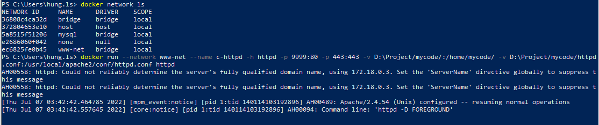

-   ra trình duyệt chạy theo cổng sau :

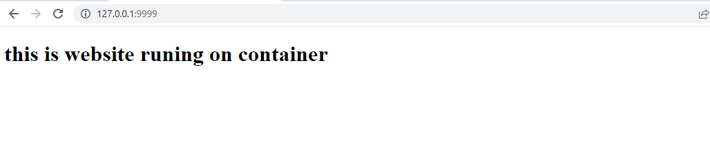

-   ra trình duyệt chạy theo cổng sau xem php đã hoạt động chưa :


-   Server API được gọi qua FPM/FastCGI.
# 3: Cài đặt, chạy MySQL bằng Docker
-    Khi chạy và cài các container chúng ta có thể thiết lập các biến môi trường cho container đó thông qua tham số là -a.
-   tạo hai biến và gán giá trị cho nó : docker run -it -e Bien1=value1 -e bien2=value2 busybox
-   Xuất giá trị của biến ra: # echo $tenbien

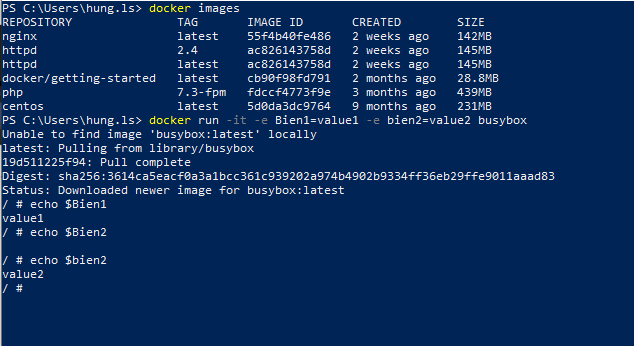

 -  Chạy lệnh code để mở vysualcode lên 
 
 ```Dockerfile
MSQL 8.0
- port: 3304
- file config: /etc/mysql/my.cnf
              [mysqld]
              default-authentication-plugin=mysql_native_password

-   root: MYSQL_ROOT_PASSWORD
-   databases: /var/lib/mysql
```

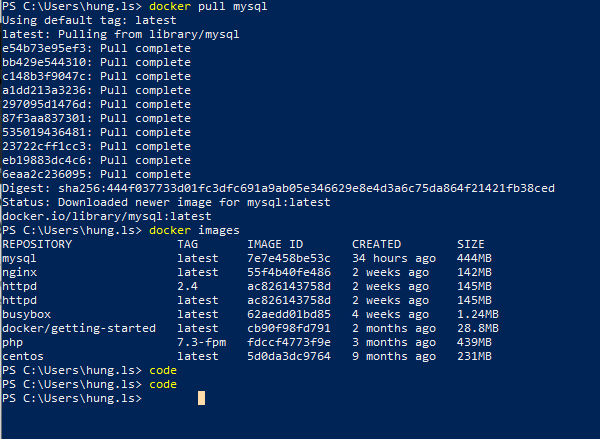

-   Chạy 
https://www.youtube.com/watch?v=Bemy5gBjZrE&list=PLWBrqglnjNl3TDF6WKpAl4maE3yJ5CpYF
# V.Làm việc với Docker Image,Container,kết nối SQL Server
## 1: 
Truy cập https://hub.docker.com/ đăng nhập tài khoản và tìm kiếm mysql image.
(chúng ta nên cho lệnh đó vào file text sau đó chúng ta chạy lệnh trong file text đó lên terminal sau.
chạy lệnh docker pull mysql và ghi vào file txt
- Khi chạy xong trên terminal chúng ta kiểm  tra nó đã được cài về chưa bằng lênh docker images
```Dockerfile
docker images
```

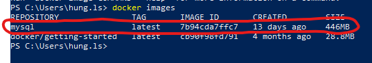

file.txt
```Dockerfile
docker pull mcr.microsoft.com/mssql/server:2019-latest
docker pull mcr.microsoft.com/mssql/server:2017-latest
tag = version
Create containers from images
1image => multiple containers
-d : Detach(background) mode
-e : enviroment variables (Các biến môi trường)
--name : Container's name
-p : port
docker run -e "ACCEPT_EULA=Y" -e "SA_PASSWORD=root@123456789" --name sql-server-2019-container -p 1435:1433 -d mcr.microsoft.com/mssql/server:2022-latest
```
chạy terminal:
```Dockerfile
docker run -e "ACCEPT_EULA=Y" -e "SA_PASSWORD=root@123456789" --name sql-server-2019-container -p 1435:1433 -d mcr.microsoft.com/mssql/server:2019-latest
```
```Dockerfile
docker ps
```
```Dockerfile
docker ps -a
```
 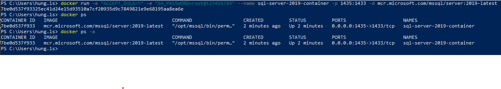

- Chạy 
```Dockerfile
docker logs 7be0d537f933
```
=> sẽ thấy những gì diễn ra trên container đó.
Cài azure data vysual https://docs.microsoft.com/en-us/sql/azure-data-studio/download-azure-data-studio?view=sql-server-ver16
- Cài đặt và chạy lên
- connect: 
+Server: localhost
+ Authencation type: Login SQL
+ username: sa
+ password: root@123456789
=> connect:

 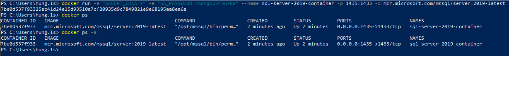
 
 - Vào database chon master click chuột phải chọn new query và chọn run
 
  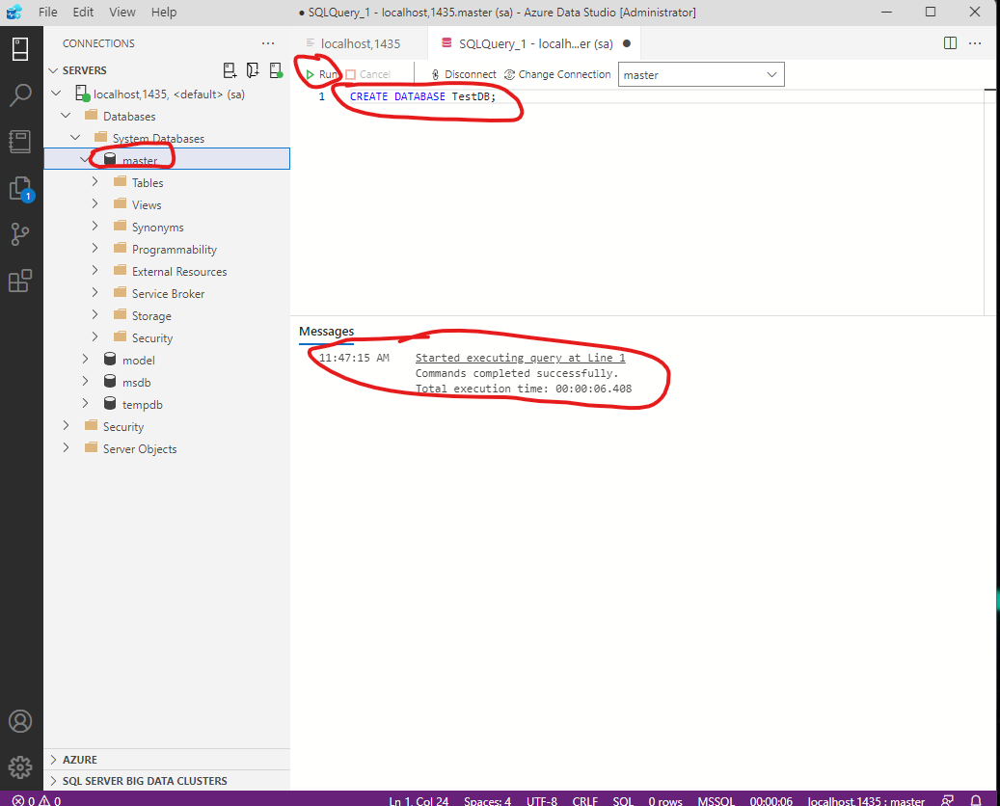
  
Nhập vào query:
```Dockerfile
CREATE DATABASE TestDB;
USE TestDB;
CREATE TABLE tblStudent(
        studentId INT IDENTITY(1, 1),
        studentName NVARCHAR(100),
        AGE INT CHECK(age > 0)
);
SELECT * FROM tblStudent;
INSERT INTO tblStudent(studentName,AGE)
VALUES('Le Sy Hung',22);
```

 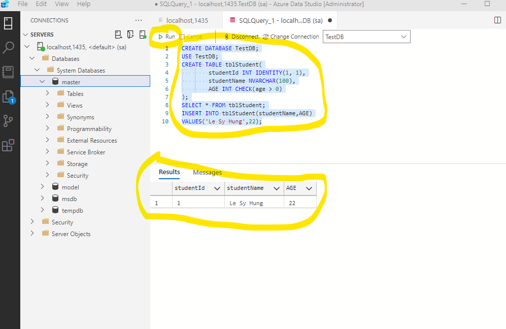

# VI: Lưu trữ SQL Server Database với Docker Volume
